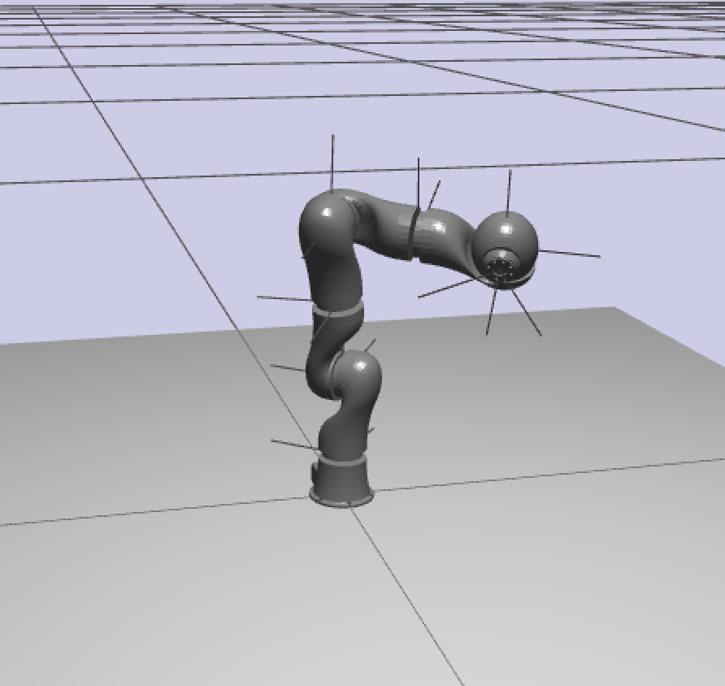

# FloBaRoID [](https://travis-ci.org/kjyv/FloBaRoID)

(FLOating BAse RObot dynamical IDentification)

FloBaRoID is a python toolkit for parameter identification of floating-base rigid body tree-structures such as
humanoid robots. It aims to provide a complete solution for obtaining physical consistent identified dynamics parameters.

<div>


</div>

Features:

* find optimized excitation trajectories with non-linear global optimization (as parameters of fourier-series for periodic soft trajectories)
* data preprocessing
    * derive velocity and acceleration values from position readings
    * data is zero-phase low-pass filtered from supplied measurements
    * it is possible to only select a combination of data blocks to yield a better condition number \[Venture2009\]
* validation with other measurement files
* excitation of robots, using ROS/MoveIt! or Yarp
* implemented estimation methods:
  * ordinary least squares, OLS
  * weighted least squares \[Zak1994\]
  * estimation of parameter error using previously known CAD values \[Gautier2013\]
  * essential standard parameters \[Pham1991\]\[Gautier2013\], estimating only those that are most certain for the measurement data and leaving the others unchanged
  * identification problem formulation with constraints as linear convex SDP problem to get optimal physical consistent standard parameters \[Sousa2014\]
  * non-linear optimization within consistent parameter space \[Traversaro2016\]
* visualization of trajectories
* plotting of measured and estimated joint state and torques (interactive, HTML, PDF or Tikz)
* output of the identified parameters directly into URDF

### Before installation

You'll need some or all of these depenencies installed in your system:

* **suite-sparse** (required for building cvxopt): `brew install suite-sparse` (macOS) or `apt install libsuitesparse-dev` (Ubuntu/Debian)
* **eigen3, swig** (required for building iDynTree): `brew install eigen@3 swig` (macOS) or `apt install libeigen3-dev swig` (Ubuntu/Debian)
* **ipopt** (for iDynTree build): `brew install ipopt` (macOS) or `apt install coinor-libipopt-dev` (Ubuntu/Debian)
* **dsdp5** (command line executable, required for SDP-constrained identification)

## Installation

Install [uv](https://docs.astral.sh/uv/getting-started/installation/), then
run e.g. `uv run identifier.py` to run the tools in uv virtual env. It will install necessary dependencies
automatically. 

## Commands

* **trajectory.py**: generate optimized trajectories

```bash
uv run trajectory.py --config configs/kuka_lwr4.yaml --model model/kuka_lwr4.urdf
```

Saves to `<model>.trajectory.npz` by default (e.g. `model/kuka_lwr4.urdf.trajectory.npz`). Override with `--filename`.

* **excite.py**: send trajectory to control the robot movement and record the resulting measurements

```bash
uv run excite.py --config configs/kuka_lwr4.yaml --model model/kuka_lwr4.urdf --filename measurements.npz
```

* **identifier.py**: identify dynamical parameters (mass, COM and rotational inertia) starting from an URDF description and from torque and force measurements

```bash
uv run identifier.py --config configs/kuka_lwr4.yaml --model model/kuka_lwr4.urdf --measurements measurements.npz
```

* **visualizer.py**: show 3D robot model of URDF, trajectory motion

```bash
uv run visualizer.py --config configs/kuka_lwr4.yaml --model model/kuka_lwr4.urdf --trajectory model/kuka_lwr4.urdf.trajectory.npz
```

### Optional extras

```bash
uv sync --extra tikz-plots      # matplotlib2tikz
uv sync --extra parallel         # mpi4py
```

### Additional non-PyPI dependencies

* symengine.py (to speedup SDP, optional)

requirements for excitation module:

* for ros, python modules: ros, moveit\_msg, moveit\_commander
* for yarp: c compiler, installed [robotology-superbuild](https://github.com/robotology-playground/robotology-superbuild), python modules: yarp
* for other robots, new modules will have to be written

requirements for trajectory optimization module:

* optional (if you want to use ipopt): pyipopt from https://github.com/xuy/pyipopt (plus cmd line ipopt/libipopt with libhsl/coin-hsl)
* mpi4py / mpirun (for parallel trajectory optimization)

Also see the [Tutorial](documentation/TUTORIAL.md).

Known limitations:

* trajectory optimization is limited to fixed-base robots at the moment (full
  simulation, balance criterion etc. not implemented)
* YARP excitation module is not very generic (ROS should be)
* using position control over YARP is not realtime safe and can expose timing issues (especially with python to C bridge)
* Since preparing SDP matrices uses sympy expressions, most of the time for solving the identification problem is spent in symbolic manipulations rather than the actual convex optimization solver. Possibly the time demands can be reduced.

SDP optimization code is based on or uses parts from [cdsousa/wam7\_dyn\_ident](https://github.com/cdsousa/wam7_dyn_ident)

Usage is licensed under the LGPL 3.0, see License.md. Please quote the following publication if you're using this software for any project:
`S. Bethge, J. Malzahn, N. Tsagarakis, D. Caldwell: "FloBaRoID — A Software Package for the Identification of Robot Dynamics Parameters", 26th International Conference on Robotics in Alpe-Adria-Danube Region (RAAD), 2017`

### References

\[Venture2009\] G. Venture, K. Ayusawa, Y. Nakamura: "A numerical method for choosing motions with optimal excitation properties for identification of biped dynamics — An application to human," IEEE International Conference on Robotics and Automation (ICRA), pp. 1226–1231, 2009.

\[Gautier1991\] M. Gautier: "Numerical calculation of the base inertial parameters of robots," Journal of Robotic Systems, vol. 8, no. 4, pp. 485–506, 1991.

\[Pham1991\] C. M. Pham, M. Gautier: "Essential parameters of robots," Proceedings of the 30th IEEE Conference on Decision and Control, Brighton, England, pp. 2769–2774, 1991.

\[Zak1994\] G. Zak, B. Benhabib, R. G. Fenton, I. Saban: "Application of the Weighted Least Squares Parameter Estimation Method to the Robot Calibration," Journal of Mechanical Design, vol. 116, no. 3, pp. 890–893, 1994.

\[Gautier2013\] M. Gautier, G. Venture: "Identification of Standard Dynamic Parameters of Robots with Positive Definite Inertia Matrix," IEEE/RSJ International Conference on Intelligent Robots and Systems (IROS), Tokyo, Japan, pp. 5815–5820, 2013.

\[Sousa2014\] C. D. Sousa, R. Cortesão: "Physical feasibility of robot base inertial parameter identification: A linear matrix inequality approach," The International Journal of Robotics Research, vol. 33, no. 6, pp. 931–944, 2014.

\[Traversaro2016\] S. Traversaro, S. Brossette, A. Escande, F. Nori: "Identification of Fully Physical Consistent Inertial Parameters using Optimization on Manifolds," IEEE/RSJ International Conference on Intelligent Robots and Systems (IROS), 2016.
